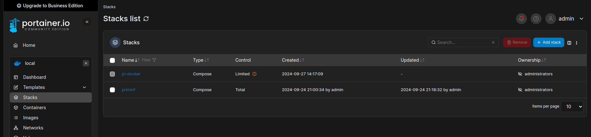
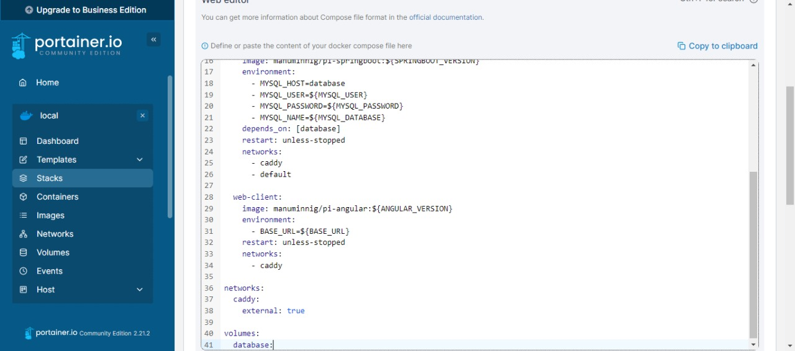
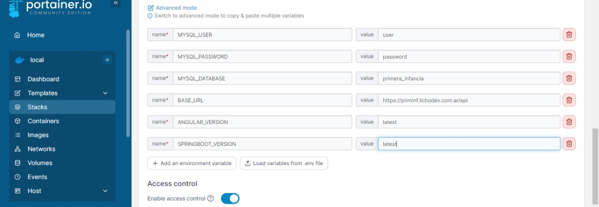
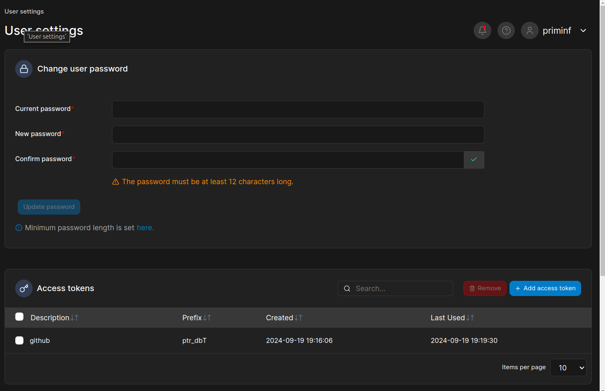
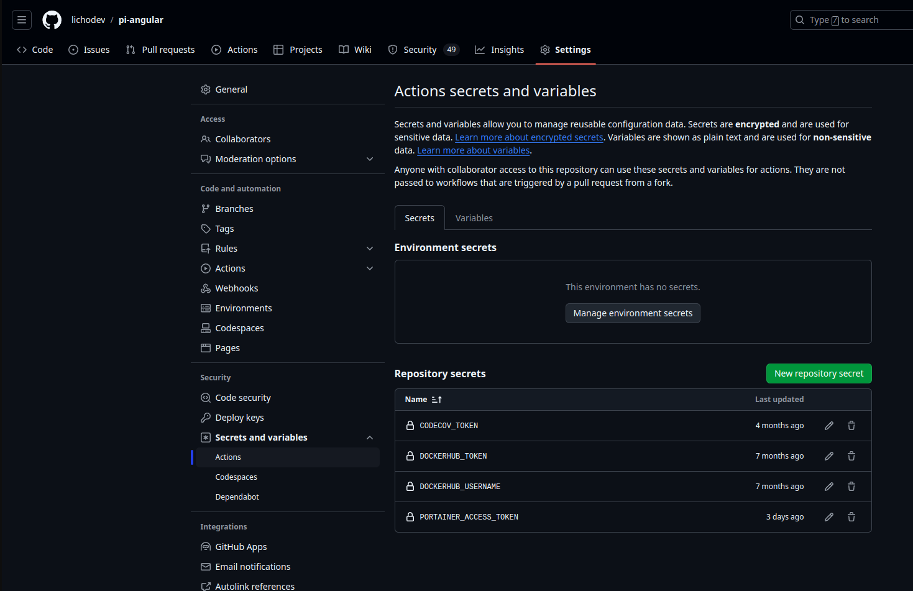

# Instalación de Primera Infancia en Docker con Portainer

## 1. Configurar VM con Docker

Requerimientos de hardware:

|             | Memoria |  CPU   | Disco |
| ----------- | :-----: | :----: | :---: |
| Minimo      |   1GB   | 1 vCPU | 20GB  |
| Recomendado |   2GB   | 2 vCPU | 20GB  |

### 1.1 Instalar Docker

Para poder trabajar en la VM, es necesario tener Docker instalado y ejecutándose en la VM. Para ello, [seguimos la documentación oficial de cómo instalar Docker Engine según tu plataforma.](https://docs.docker.com/engine/install/)

En el caso de Ubuntu, son necesarios los siguientes comandos (nótese que si se está usando el usuario `root` hay que evitar usar el comando `sudo`):

```sh
# Add Docker's official GPG key:
sudo apt-get update
sudo apt-get install ca-certificates curl -y
sudo install -m 0755 -d /etc/apt/keyrings
sudo curl -fsSL https://download.docker.com/linux/ubuntu/gpg -o /etc/apt/keyrings/docker.asc
sudo chmod a+r /etc/apt/keyrings/docker.asc

# Add the repository to Apt sources:
echo \
  "deb [arch=$(dpkg --print-architecture) signed-by=/etc/apt/keyrings/docker.asc] https://download.docker.com/linux/ubuntu \
  $(. /etc/os-release && echo "$VERSION_CODENAME") stable" | \
  sudo tee /etc/apt/sources.list.d/docker.list > /dev/null
sudo apt-get update

# Install Docker
sudo apt-get install docker-ce docker-ce-cli containerd.io docker-buildx-plugin docker-compose-plugin -y
```

### 1.2 Configurar usuario no-root

Si se utiliza un usuario no-root, se debe agregar al usuario al grupo `docker` para poder ejecutar contenedores sin necesidad de sudo. Hay una guía que indica los [pasos post-instalación para sistemas operativos Linux](https://docs.docker.com/engine/install/linux-postinstall/).

```sh
sudo usermod -aG docker $USER
newgrp docker
# Desloguear y volver a loguear
```

## 2. Levantar Caddy con Portainer

### 2.1 Git Clone

Como el dump inicial está directamente en el repo, es necesario utilizar [Git LFS](https://git-lfs.com/) para descargar los archivos relativamente grandes:

```sh
curl -s https://packagecloud.io/install/repositories/github/git-lfs/script.deb.sh | sudo bash
sudo apt install git-lfs
git lfs install
```

Luego, clonamos el repositorio:

```
git clone https://github.com/lichodev/pi-docker
git lfs pull
```

### 2.2 Levantar Caddy

Una vez configurado Docker, hay que levantar dos servicios mínimos: [Caddy](https://caddyserver.com/) y [Portainer](https://www.portainer.io/). El primero actuará de proxy reverso, y se encargará de generar los certificados. El segundo, es un panel de adminstración web para host Docker.

La variable de entorno `DOMINIO` debe coincidir con el dominio donde va a ser expuesta la aplicación.

```sh
export DOMINIO=tudominio.com

sed -i "s/priminf.unicen.edu.ar/$DOMINIO/g" Caddyfile

docker compose -f docker-compose.base.yml up -d
```

Una vez levantado los contenedores, se va a poder navegar https://tudominio.com/portainer/ y acceder al panel de administración, donde vas a poder crear el primer usuario de Portainer.

Por defecto, la configuración del proxy va a exponer 3 path:

| Path          |    Servicio    | Uso                                                                                              |
| ------------- | :------------: | ------------------------------------------------------------------------------------------------ |
| /\*           |   web-client   | Frontend en Angular                                                                              |
| /api/\*       | api-springboot | API rest en Java. Es necesario utilizar https://tudominio.com/api como `BASE_URL` más adelante. |
| /portainer/\* |   portianer    | Interfaz web de Portainer                                                                        |

## 3. Crear _stack_ de Primera Infancia

Primero debemos definir las variables de entorno que utilzaremos como referencia para el script de Backup y los datos a ingresar en el Stack de Portainer. Nos basamos en el archivo `.env.example`:

```sh
cp .env.example .env
```

Una vez creado el fichero, hay que modificarlo y asignar los valores correctos. `BACKUP_FOLDER` debe ser una carpeta que el usuario que realice el backup tenga permisos de escritura y lectura.

```sh
mkdir -p /path/hasta/backup
```

El docker-compose necesario para crear el stack es `docker-compose.app.yml`; copiamos su contenido en el formulario de Crear Stack (Environment > local > stacks > create stack):







Completamos, en la interfaz web, las variables de entorno necesarias para Portainer:

| ENV                | Uso                                            | `.env` | Portainer |
| ------------------ | ---------------------------------------------- | :----: | :-------: |
| MYSQL_USER         | Usuario de MySQL                               |   Sí   |    Sí     |
| MYSQL_PASSWORD     | Clave de MySQL                                 |   Sí   |    Sí     |
| MYSQL_DATABASE     | Base de Datos en MySQL                         |   Sí   |    Sí     |
| BASE_URL           | URL a la API                                   |   No   |    Sí     |
| ANGULAR_VERSION    | Debe quedar en `latest` o el tag de producción |   No   |    Sí     |
| SPRINGBOOT_VERSION | Debe quedar en `latest` o el tag de producción |   No   |    Sí     |
| BACKUP_FOLDER      | El directorio donde se escriben los dump       |   Sí   |    No     |

Finalmente, presionamos `Desplegar / Deploy`.

## 4. Configurar CD

Para configurar que se despliegue automáticamente los nuevos contenedores, se utiliza un script en ambos proyectos de código fuente (`redeploy.mjs`).

### 4.1 Ajustar configuración en los repositorios

Cada repositorio de código fuente (`pi-angular` y `pi-springboot`) tiene un script `redeploy.mjs` que hay que ajustar según el entorno. Específicamente, hay que ajustar 3 campos. **Si el despliegue es exactamente igual a este ejemplo, únicamente cambiar `API`** 
- `API`: hay que poner el dominio del portainer desplegado anteriormente, manteniendo el path de ejemplo
- `id`: hay que cambiarlo por el ID del stack de `priminf`. Ej: https://priminf.unicen.edu.ar/portainer/#!/2/docker/stacks/priminf?**id=1**
- `endpointId`: hay que cambiarlo por el ID del `environment`. Ej: https://priminf.unicen.edu.ar/portainer/#!/**2**/docker/stacks/priminf?id=1

### 4.2 Crear token

Para crear el token, se genera en el perfil de usuario de portainer:



Luego, hay que agregarlo como variable de entorno en el CI de GitHub con el nombre de "PORTAINER_ACCESS_TOKEN":



## 5. Configurar backups

### 5.1 Configurar `crontab`

En este repositorio se provee un script de backup simple que genera un dump de la base de datos, y ejecuta el comando `upload-backup <dump>` para poder subir el archivo. En el archivo `.env` se debe definir un directorio donde se van a guardar los backup. Si no se define, utilizará un directorio temporal. Esto último es útil si se copia el backup a un destino remoto.

```sh
crontab -e

# dentro de crontab
@daily /path/hasta/backup.sh >> /var/log/backup.app.log
# o si se desea semanal
@weekly /path/hasta/backup.sh >> /var/log/backup.app.log
```

Esto generará un dump local. Cada entorno deberá definir una implemetación del script `upload-backup`, donde se decidira si subirlo a S3, Google Drive, FTP, scp, etc.

Un ejemplo es realizar scp a otro servidor, para guardar el backup:

```sh
#! /bin/env bash
#
# esto es el archivo /usr/bin/upload-backup
scp $1 backup@backup.server:~/backups/
```

De esta forma, se puede cambiar el esquema con el que se distribuirá el backup sin estar atado a una tecnología o método.
